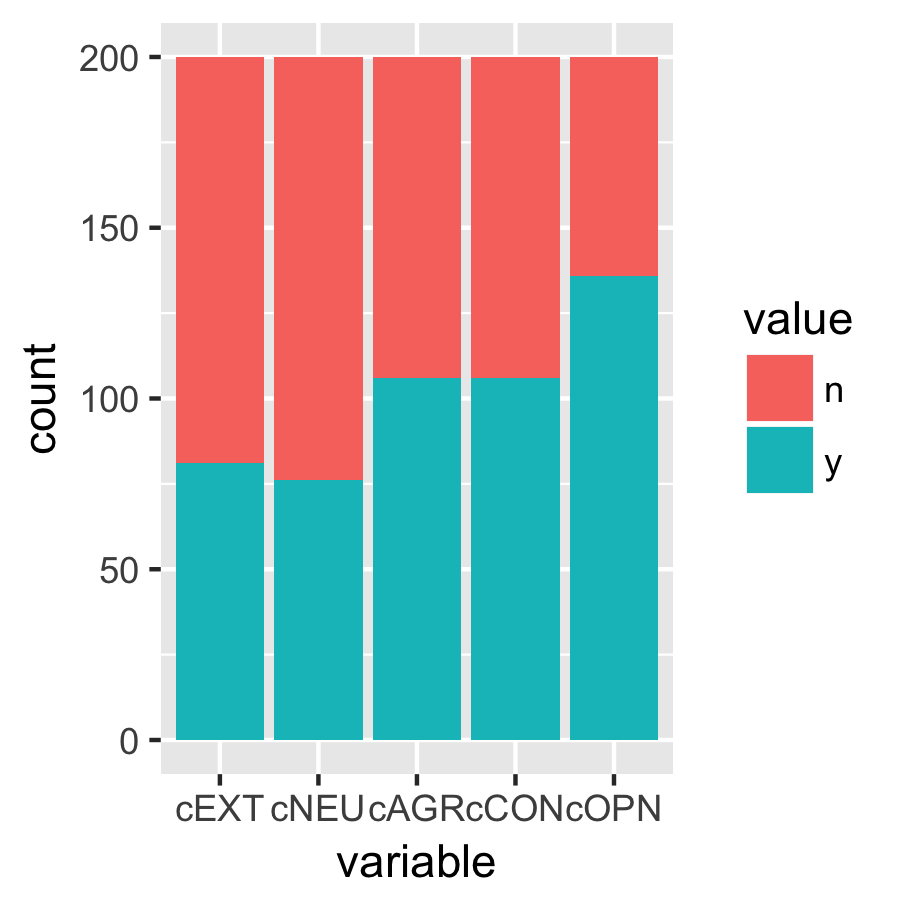

# Personality recognition

## Data
myPersonality is a sample of personality scores and Facebook profile data collected by David Stillwell and Michal Kosinski through a Facebook application that implements the NEO-PI-R (five factor personality test, Costa & McCrae) and other psychological tests. This dataset is a subset containing 250 users and about 9900 status updates. It includes Facebook statuses in raw text, gold standard personality labels both as scores and as classes derived froma median split of the scores. It also includes several social network measures such as: network size, betweenness centrality, density, brokerage, transitivity.

The status updates in myPersonality have been anonymized manually, with each proper name replaced by a fixed string (*PROPNAME*), though famous named entities such as Chopin or New York have not been replaced.

The data has been split into 80% train and 20% test. You will receive the training subset. The class distributions of the training data are as follows:

